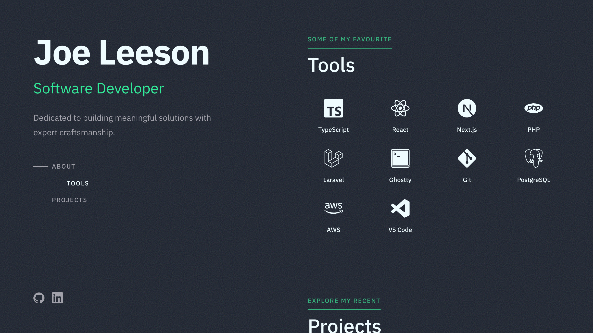

# Joe Leeson

A minimal, performance-focused developer portfolio built with [Astro](https://astro.build) and Sass.

**Live site:** [joeleeson.com](https://joeleeson.com)



## Tech Stack

- [Astro](https://astro.build)
- Sass with CSS Modules

## Getting Started

### Prerequisites

- Node.js 18+

### Installation

1. Clone the repository

```bash
git clone https://github.com/jaleeson11/joeleeson-v2.git
```

2. Navigate to the project directory

```bash
cd joeleeson-v2
```

3. Install dependencies

```bash
npm install
```

4. Run the development server

```bash
npm run dev
```

5. Open [http://localhost:4321](http://localhost:4321) in your browser

### Build for Production

```bash
npm run build
npm run preview
```

## License

MIT
